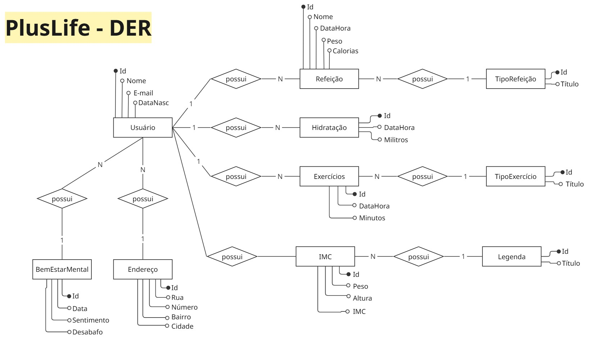
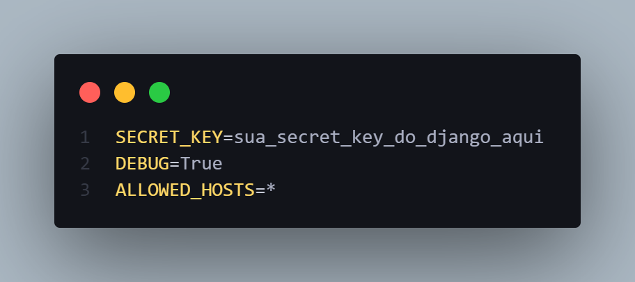
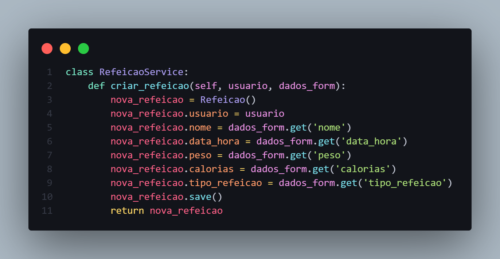
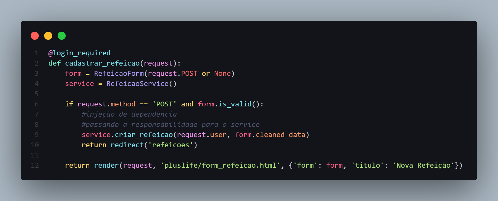
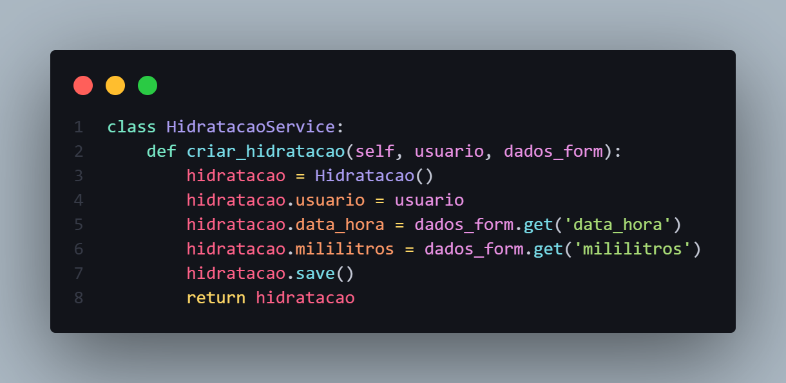
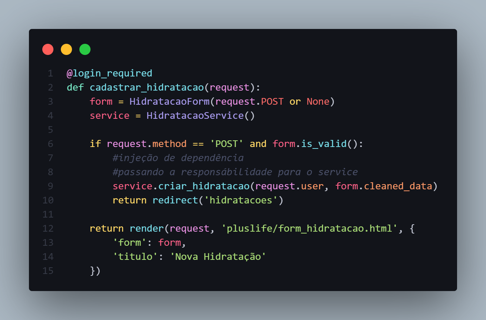

# 💾 Tecnologia em Análise e Desenvolvimento de Sistemas

5° Semestre - IFMT Campus Campo Verde.  
Projeto para a Disciplina de *Programação de Dispositivos Móveis II*

---

### 💡 Autores
- [João Victor](https://github.com/JoaoVictor-Noschang)

<br>

# ➕💚 PlusLife Web

O PlusLife é um site web desenvolvido para auxiliar usuários a monitorar e manter um estilo de vida saudável, registrando atividades físicas, alimentação e hidratação. Ele oferece as seguintes funcionalidades (Requisitos Funcionais):
- [RF1] O sistema deve manter usuários.
- [RF2] O sistema deve manter registros de bem estar mental do usuário.
- [RF3] O sistema deve manter registros de refeições do usuário.
- [RF4] O sistema deve manter registros de tipos de refeições.
- [RF5] O sistema deve manter registros de hidratação do usuário.
- [RF6] O sistema deve manter registros de exercícios do usuário.
- [RF7] O sistema deve manter registros de tipos de exercícios.
- [RF8] O sistema deve calcular IMC (Indice de massa corporal).
- [RF9] O sistema deve manter um histórico de IMCs (Indice de massa corporal).

<br>

## Utilizou-se o seguinte DER (Diagrama Entidade Relacionamento)

- Onde possuimos 10 entidades, com seus respectivos relacionamentos:

    <p align="left" >
        
    </p>

<br>

# 🤓 Como rodar o projeto?

Para executar o *PlusLife* em sua máquina, siga os passos abaixo:

1.  *Clone o Repositório:*

    Abra seu terminal ou prompt de comando e execute:

    ```bash
    git clone [https://github.com/JoaoVictor-Noschang/pwii_pd.git](https://github.com/JoaoVictor-Noschang/pwii_pd.git)
    ```
    
<br>

2.  *Recrie o ambiente virtual (.venv):*

    Navegue até o diretório do projeto clonado. É uma boa prática criar um ambiente virtual para isolar as dependências do projeto das dependências globais do seu sistema. 
    
    O projeto já indica o uso de um ambiente virtual chamado .venv, recrie ele:
    ```bash
    python -m venv .venv
    ```

    Ative ele (comando para windows): 
    ```bash
    .venv\Scripts\activate
    ```

    Você saberá que o ambiente virtual está ativo quando vir (.venv) no início da linha de comando.

<br>

3.  *Instale todas as dependências ao mesmo tempo:*

    O projeto possui um arquivio chamado *requirements.txt* onde lista todas as dependências necessárias. Intale-as pelo comando:

    ```bash
    pip install -r requirements.txt
    ```
    
    Aqui ele irá instalar o framework e as bibliotecas:
    - **django**: Um framework web de alto nível em Python que incentiva o desenvolvimento rápido e um design limpo e pragmático.

    - **python-decouple**: Uma biblioteca simples para separar as configurações do seu código. Facilita o armazenamento de variáveis sensíveis (como chaves secretas e configurações de banco de dados) em arquivos .env ou variáveis de ambiente, mantendo-as fora do controle de versão.

    - **dj-database-url**: Permite configurar as configurações de banco de dados do Django usando uma única URL de ambiente. Isso é extremamente útil para implantações em serviços de hospedagem que fornecem as informações do banco de dados como uma URL.

<br>

4.  *Configure o arquivo .env:*

    Muitos projetos usam o **python-decouple** para gerenciar variáveis de ambiente. 

    Crie na raiz do projeto um arquivo chamado **.env** com a seguinte estrutura:

    <p align="left">
        
    </p>

<br>

5.  *Configure o banco de dados:*

    Rodamos as migrações do banco, como é a primeira vez, ele irá criar uma nova *migration*:

    ```bash
    python manage.py migrate
    ```


<br>

6.  *Execute o servidor de desenvolvimento:*

    Rodamos o servidor de desenvolvimento para que o projeto esteja disponível no *localhost* para interações:

    ```bash
    python manage.py runserver
    ```

<br>

## 🔧 Features mínimas

O sistema deve possuir as seguintes features minimas:

- Possuir 10 entidades;

    - ✅ Projeto possui 10 entidades: Usuário, Endereço, Refeição, TipoRefeição, Hidratação, Exercício, TipoExercício, IMC(Índice de Massa Corporal), LegendaImc, BemEstar. *Estão detalhadas no DER no inicio do documento.*

    <br>

- Pelo menos duas injeções de dependências;

    - ✅ Possui três, os quais são services que são chamadas nas views responsáveis pela criação de registros de refeições, hidratações e exercício.
        - Service para instâncias uma refeição - em **services.py**

            

        - View para a criação de uma nova refeição - em **views.py**

            

        <br>
        
        - Service para instâncias uma hidratação - em **services.py**

            

        - View para a criação de uma nova hidratação - em **views.py**

            
        
        <br>
        
        - Service para instâncias um exercício - em **services.py**

            

        - View para a criação de um novo exercício - em **views.py**

            

        <br>

- Possuir um DER (Diagrama entidade relacionamento).

    - ✅ Possui, está ilustrado no inicio deste documento.

<br>

# Tecnologias Utilizadas

Este projeto foi construído utilizando as seguintes tecnologias e bibliotecas:

* **Python:** Uma linguagem de programação de alto nível, interpretada e de propósito geral, conhecida por sua sintaxe clara e legibilidade.
* **Framework Django:** Um framework web de código aberto escrito em Python, que incentiva o desenvolvimento rápido e um design limpo e pragmático. 

<br>
